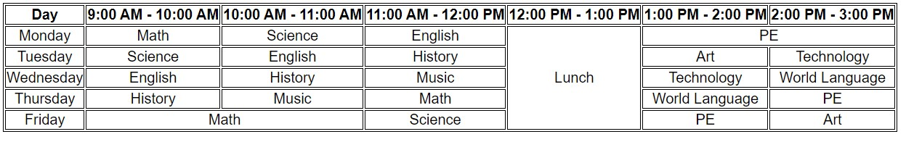

# แบบฝึกหัด 7 เขียนโปรแกรม
* สร้างโฟลเดอร์ html_course_ex7 และเปิดเข้าไปในโฟลเดอร์
* เปิดไฟล์ `index.html` **ที่แนบมากับบทเรียนนี้ขึ้นมา** และทำตามคำสั่งดังต่อไปนี้ (สามารถดูผลลัพธ์ได้ด้วยการเปิดไฟล์นี้ด้วย browser และ refresh ก่อน 1 ครั้ง เมื่อมีการแก้ไข)

1. จงใช้ html สร้างตารางดังรูปด้านล่างนี้

